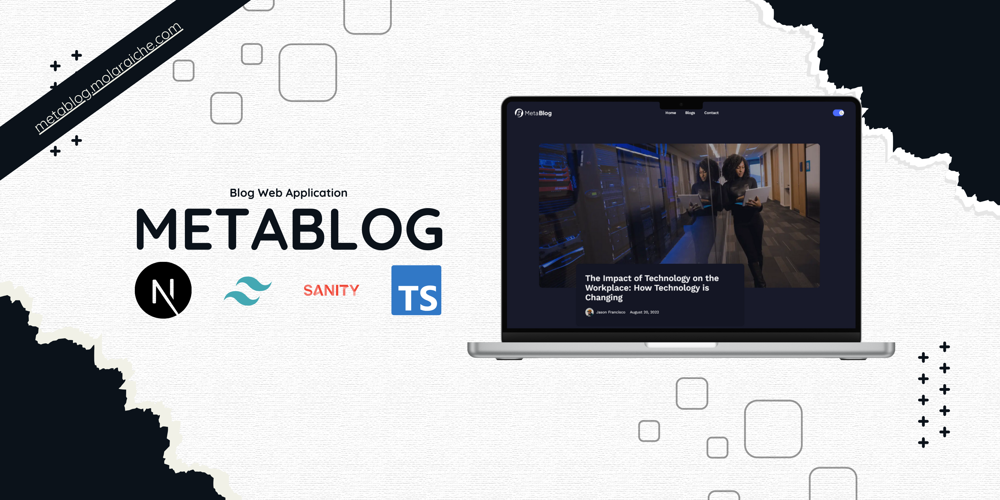

# Metablog

Metablog is a fullstack functioanl web application that provide fully control blog with fancy dashboard

## Purpose

build this applciation to deliver a product i always want blogs to provide it with this fancy way (more details coming soon)

## Main Features ( this project is still under build)

- Dark mode, filter, search functionalities
- Comprehensive SEO optimization.

## Technologies Used

- [Next.js](https://nextjs.org/)
- [Tailwind CSS](https://tailwindcss.com/)
- [TypeScript](https://www.typescriptlang.org/)
- [Sanity](https://www.sanity.io/)

## 🚀 Running the Development Server

```bash

# clone the project
git clone https://github.com/molaraiche/metablog.git

# go to the folder
cd metablog

# Install dependencies
npm install

# Start the development server
npm run dev
```

## Developer Contact

[molaraiche](http://molaraiche.com/)
